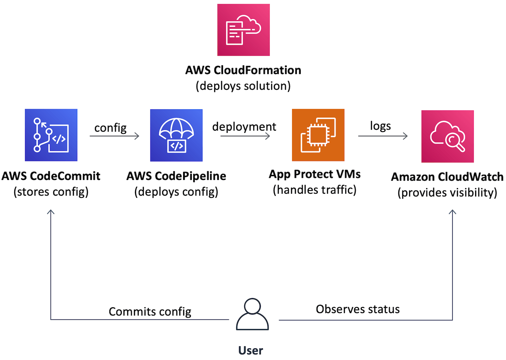
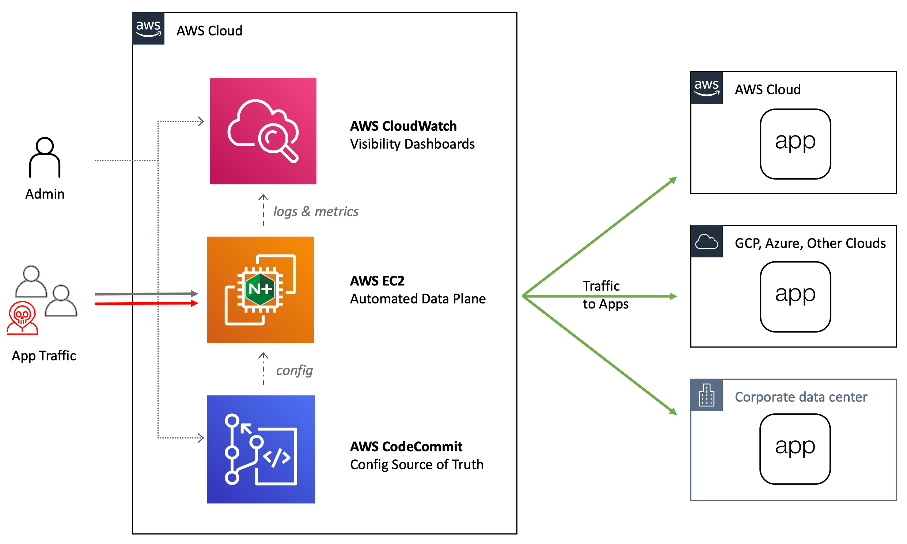
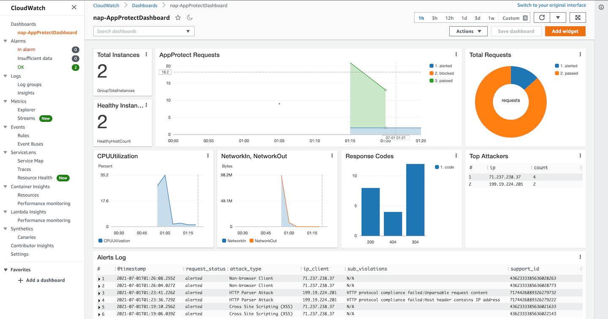

# Overview

Deployment of production grade WAF is challenging. Usually it takes at least several weeks for an average team to learn, design, implement and automate a WAF deployment. However, system design principles are always the same and every team ends up building a similar system.

The main purpose of this project is to provide an AWS CloudFormation template that follows system design principles and deploys complete, production grade WAF solution to AWS cloud. 

# Solution Overview

The idea behind this solution is to provide a production grade WAF data plane and streamline day to day WAF operations via user friendly interfaces for configuration and visibility. Following picture represents high level architecture.



Solution consists of three main components:
1. WAF data plane
2. Interface for WAF configuration 
3. Interface for WAF visibility

Data plane uses official NGINX App Protect AMIs as a WAF engine. It is fully maintenance-less, automated and auto-scales up and down based on amount of traffic flying through.

GitOps is used as configuration approach. AWS CodeCommit git repo contains default configuration for a WAF. After that every configuration change user commits in git automatically applies to the running WAF data plane.

Data plane VMs continiously send logs and metrics to AWS CloudWatch. It in turn provides a dashboard with detailed visibility to WAF security and performace.

Therefore, the solution allows to use a WAF from day zero. It provides maintnaince free data plane, convinient tool for configuration management, and complehensive visibility to the system.

# Deployment Model

Template deploys a WAF into a separate AWS VPC, therefore deployment model becomes similar to SaaS.



In which case all traffic arriving from users gets inspected and then forwarded to one or more applications regardless of their location.

# Getting Started

## Deployment

Deployment process is standard as for any other CloudFormation template. The deployment requires subscription to [NGINX Plus with NGINX App Protect Developer - Ubuntu 18.04](https://aws.amazon.com/marketplace/pp/prodview-xogyq23b3mfge)

1. Download template from `templates` folder to your filesystem
2. Open AWS CloudFormation console and click "Create Stack"
3. Select "Upload from a template file" and upload template from local filesystem
4. Give stack a name. All other parameters are optional.
5. Set a checkbox against "I acknowledge that AWS CloudFormation might create IAM resources with custom names."
6. Click create stack.

Or click the button below:

[](https://console.aws.amazon.com/cloudformation/home?#/stacks/new?stackName=NAP&templateURL=https://aws-waf-solution-template.s3.amazonaws.com/release/v1.0.0/templates/nginx-plus-app-protect-ubnt1804-dev.template.yaml)

Or use following command to create a stack using aws cli:
```
$ aws cloudformation create-stack --stack-name NAME_OF_YOUR STACK \
    --capabilities CAPABILITY_NAMED_IAM \
    --template-body https://aws-waf-solution-template.s3.amazonaws.com/release/v1.0.0/templates/nginx-plus-app-protect-ubnt1804-dev.template.yaml
```

## Operations

Once stack deploys successfully you can access, configure and monitor the WAF deployment.

### Access

Navigate to "CloudFormation -> Your Stack -> Outputs" and click on "AppProtectLBDNSName". WAF returns a default static page.

### Configuration

Navigate to "AWS CodeCommit Service -> nap-AppProtectRepo". NGINX configuration locates at "files/etc/nginx/nginx.conf". App Protect configuration lives in "files/etc/app_protect". Modify these files in the same way you would do for standalone NGINX and commit changes. New configuration will be applied to the data plane automatically. You can monitor config deployment process in "AWS CodePipeline Service -> nap-AppProtectPipeline"

### Monitoring

Open "AWS Cloudwatch -> Dashboards -> nap-AppProtectDashboard". This dashboard contains various security and performance related data.


# Contributing

This is a community project. Everyone is welcome to contribute.

# Community Code of Conduct

Please refer to the [F5 DevCentral Community Code of Conduct](code_of_conduct.md).

# Support

For support, please open a GitHub issue.  Note, the code in this repository is community supported and is not supported by F5 Networks.

# License

## Apache V2.0

Licensed under the Apache License, Version 2.0 (the "License"); you may not use
this file except in compliance with the License. You may obtain a copy of the
License at

http://www.apache.org/licenses/LICENSE-2.0

Unless required by applicable law or agreed to in writing, software
distributed under the License is distributed on an "AS IS" BASIS,
WITHOUT WARRANTIES OR CONDITIONS OF ANY KIND, either express or implied.
See the License for the specific language governing permissions and limitations
under the License.

# Copyright

Copyright 2014-2020 F5 Networks Inc.

## F5 Networks Contributor License Agreement

Before you start contributing to any project sponsored by F5 Networks, Inc. (F5) on GitHub, you will need to sign a Contributor License Agreement (CLA).

If you are signing as an individual, we recommend that you talk to your employer (if applicable) before signing the CLA since some employment agreements may have restrictions on your contributions to other projects.
Otherwise by submitting a CLA you represent that you are legally entitled to grant the licenses recited therein.

If your employer has rights to intellectual property that you create, such as your contributions, you represent that you have received permission to make contributions on behalf of that employer, that your employer has waived such rights for your contributions, or that your employer has executed a separate CLA with F5.

If you are signing on behalf of a company, you represent that you are legally entitled to grant the license recited therein.
You represent further that each employee of the entity that submits contributions is authorized to submit such contributions on behalf of the entity pursuant to the CLA.